---
## Front matter
title: **"Отчет по лабораторной №2"**
subtitle: *"Дисциплина: Архитектура Компьютера"*
author: "Прокопьева Марина Евгеньевна"

# Цель работы

Целью работы является изучить идеологию и применение средств контроля
версий. Приобрести практические навыки по работе с системой git.

# Задание

- Создание учетной записи на GitHub
- Настройка Github
- Создание SSH ключа 
- Сознание рабочего пространства и репозитория курса на основе
шаблона
- Сознание репозитория курса на основе шаблона
-Настройка каталога курса
- Задание для самостоятельной работы

# Теоретическое введение

| Команда             | Описание                                                                                                                   |
|---------------------|----------------------------------------------------------------------------------------------------------------------------|
| `git init`          | Создание основного дерева репозитория                                                                                      |
| `git pull `         | Получение обновлений (изменений) текущего дерева из центрального репозитория                                               |
| `git push`          | Отправка всех произведённых изменений локального дерева в центральный репозиторий					   |
| `git status`        | Просмотр списка изменённых файлов в текущей директории 									   |
| `git diff`          | Просмотр текущих изменения												   |
| `git add . `        | Добавить все изменённые и/или созданные файлы и/или каталоги								   |
| `git add файл`      | Добавить конкретные изменённые и/или созданные файлы и/или каталоги							   |
| `git rm файл`       | Удалить файл и/или каталог из индекса репозитория (при этом файл и/или каталог остаётся в локальной директории)            |
| `git commit -am`    | Сохранить все добавленные изменения и все изменённые файлы								   |
| `git checkout -b `  | Создание новой ветки, базирующейся на текущей										   |
| `git checkout`      | Переключение на некоторую ветку 											   |
| `git push origin`   | Отправка изменений конкретной ветки в центральный репозиторий 								   |
| `git merge --no-ff` | Слияние ветки с текущим деревом 											   |
| `git branch -d`     | Удаление локальной уже слитой с основным деревом ветки  								   |
| `git branch -D`     | Принудительное удаление локальной ветки											   |
| `git push origin`   | Удаление ветки с центрального репозитория										   |
|--------------------------------------------------------------------------------------------------------------------------------------------------|

# Выполнение лабораторной работы

Создала учётную запись на сайте GitHub. Заполняю данные и регистрирую аккаунт. (рис.001).

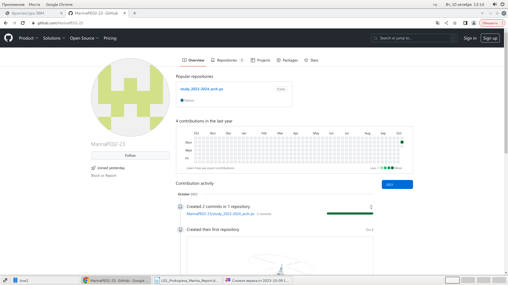

Запускаю виртуальную машину и задаю предварительную конфигурацию git. Ввожу команды. 

Настраиваю utf-8 .

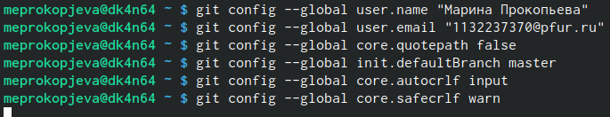

Задаю имя мастер для начальной ветки.

Задаю параметр autcorlf со значением input. 

Задаю параметр safecrlf со значением warn 

Ввожу команду ssh-keygen -C “имя фамилия, почта”, указываю свои данные. Ключ сохраняется в каталоге  ~/.ssh/.

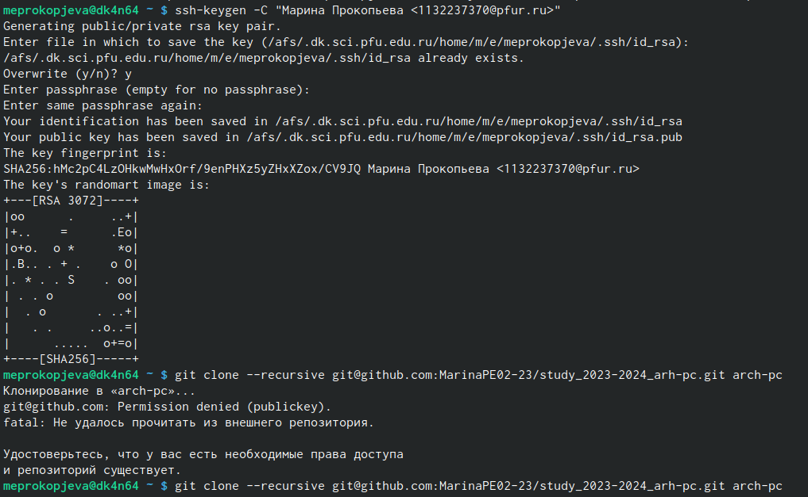

Копирую ключ из директории.

Открываю свой профиль и выбираю страницу SSH and GPG key. Нажимаю кнопку New SSH key и вставляю скопированные ключ в специальное поле и называю своим именем.

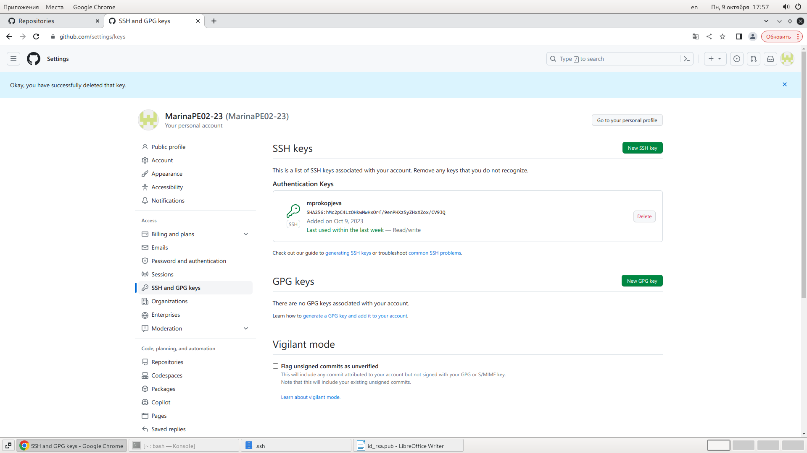

Открываю терминал и создаю директорию, рабочее пространство с помощью утилиты mkdir и ключа –p создаю все директории после домашней ~/work/study/2023-2024/”Computer archotecture” рекрусивно. Проверяю. 

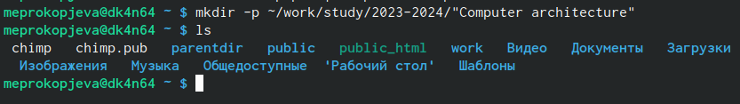

В браузере перехлжу на страницу репозитори с шаблоном курса. Выбираю Use this template, для использования этого шаблона для своего репозитория. 

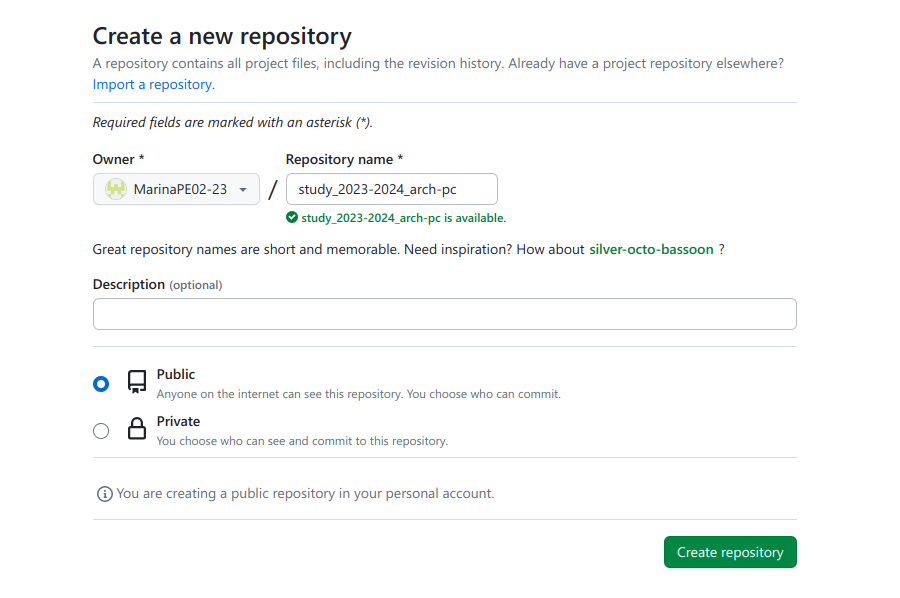

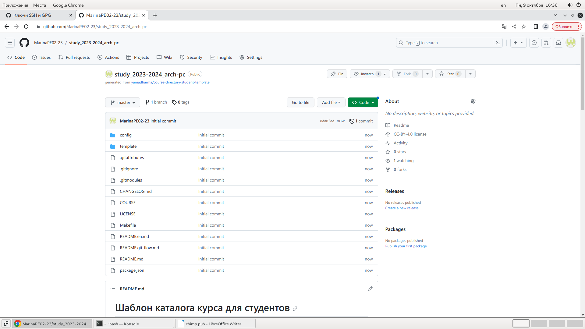

Через терминал перехожу в созданнцй каталог курса с помощью cd

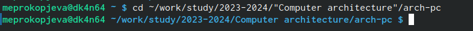

Копирую ссылку для клонирования на странице созданного репозитория.

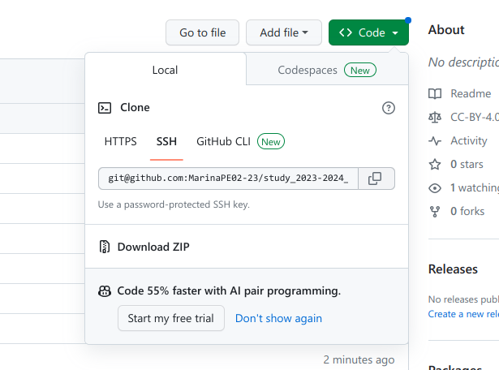
Клонирую созданный репозиторий с помощью команды Клонирую созданный репозиторий с помощью команды 

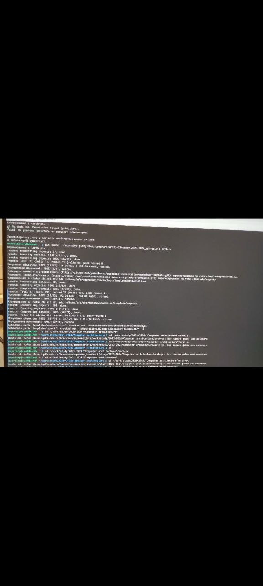

Перехожу в каталог arch-pc 

Удаляю лишнее с помощью rm 

Создаю необходимые каталоги 

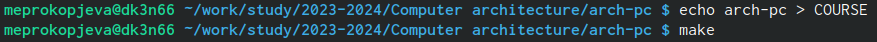

Отправляю созданные каталоги на сервер и сохраняю изменения. 

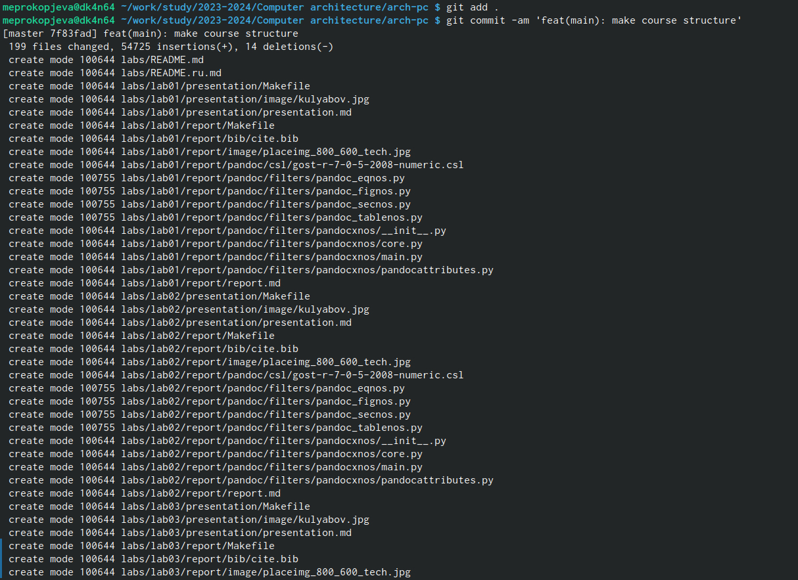

Отправляю все на сервер с помощью push 

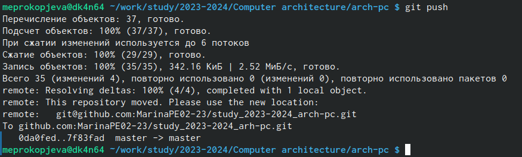

Проверяю правильность выполнения работы на сайте 

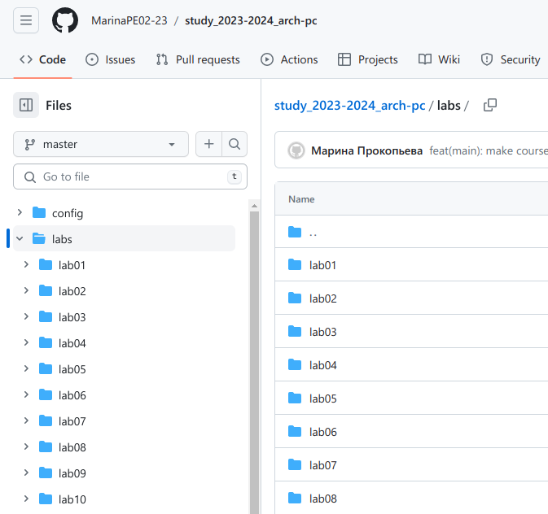

*Самостоятельная работа*

Перехожу в директорию labs/lab02

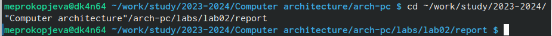

Создание файла для отчетов и приступление к работе через LibreOfficeWriter

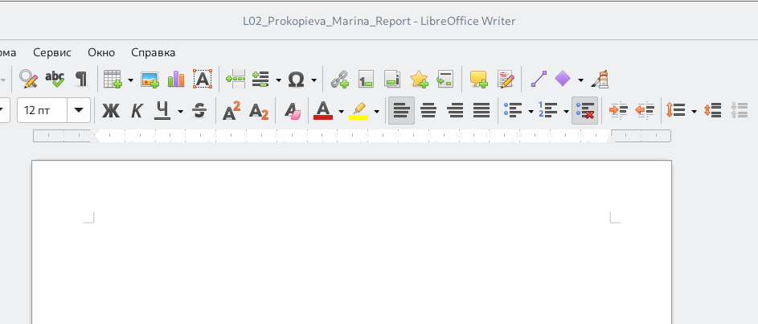

Перехожу в lab01/report

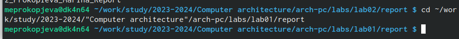

Проверяю нахождение файлов с отчетом 

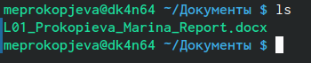

Копирую первую лабораторную и проверяю выполнение команды 

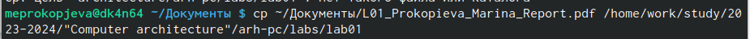

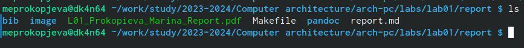

Сохраняю изменения на сервере командой git commit -m то же самое делаю и для второй лабораторной

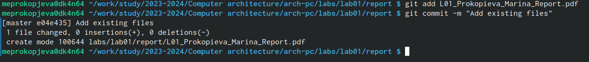

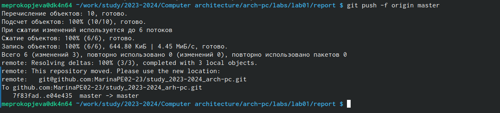

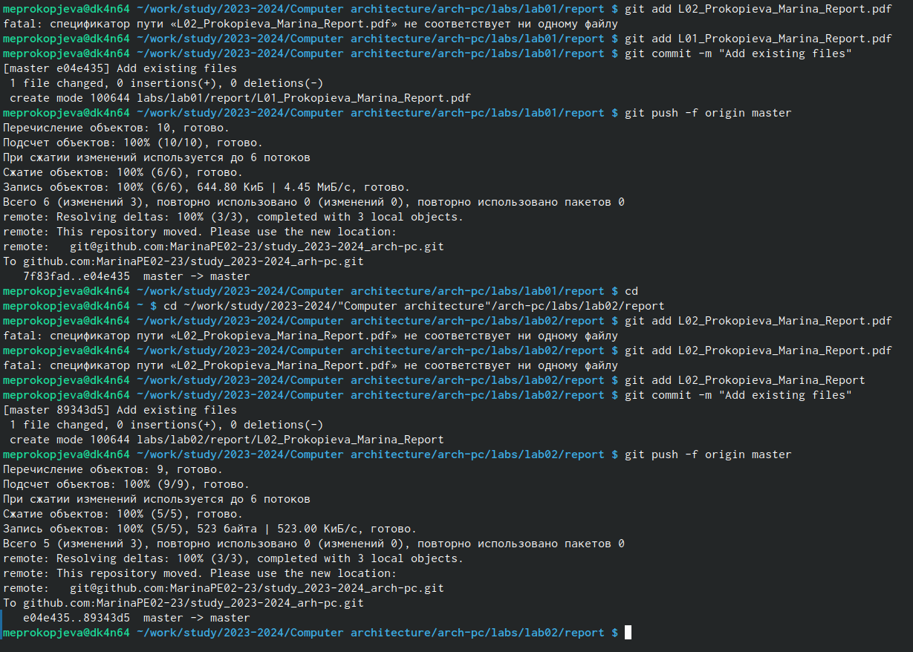

Проверяю на сайте что все правильно выполнилось 

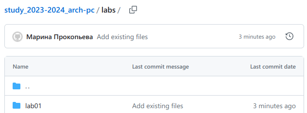

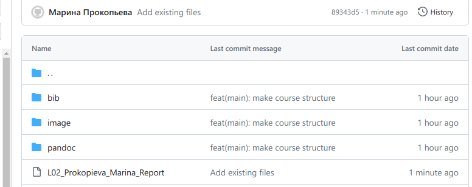

# Выводы

Изучила идеологию и применила средства контроля версий. Приобрела практические навыки по работе с системой git.

# Список литературы{.unnumbered}
-[Архитектура ЭВМ](https://esystem.rudn.ru/pluginfile.php/2091228/mod_resource/content 0/%D0%9B%D0%B0%D0%B1%D0%BE%D1%80%D0%B0%D1%82%D0%BE%D1%80%D0%BD%D0%B0%D1%8F%20%D1%80%D0%B0%D0%B1%D0%BE%D1%82%D0%B0%20%E2%84%962.%20%D0%A1%D0%B8%D1%81%D1%82%D0%B5%D0%BC%D0%B0%20%D0%BA%D0%BE%D0%BD%D1%82%D1%80%D0%BE%D0%BB%D1%8F%20%D0%B2%D0%B5%D1%80%D1%81%D0%B8%D0%B9%20Git.pdf)

