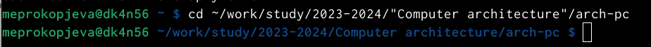
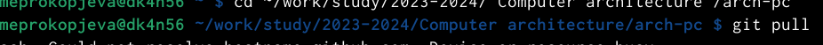
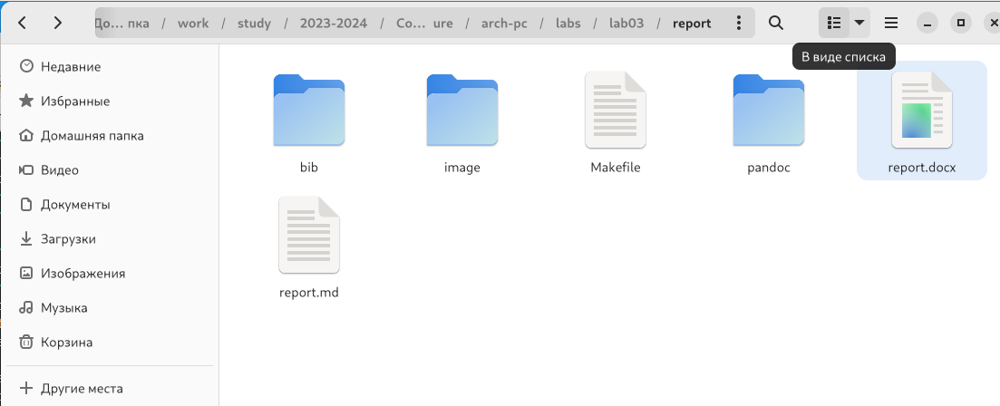
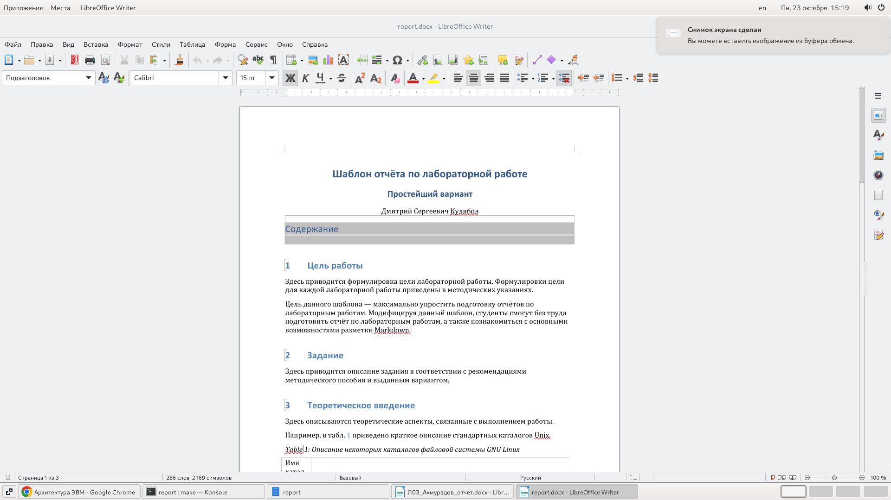
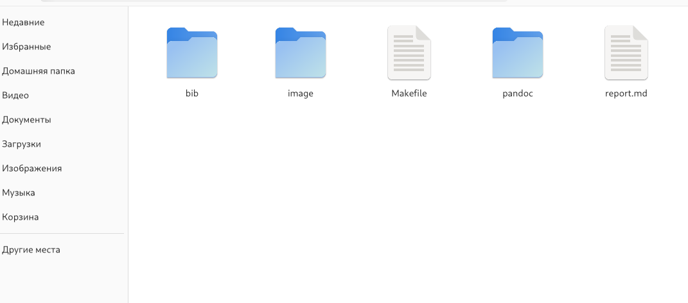
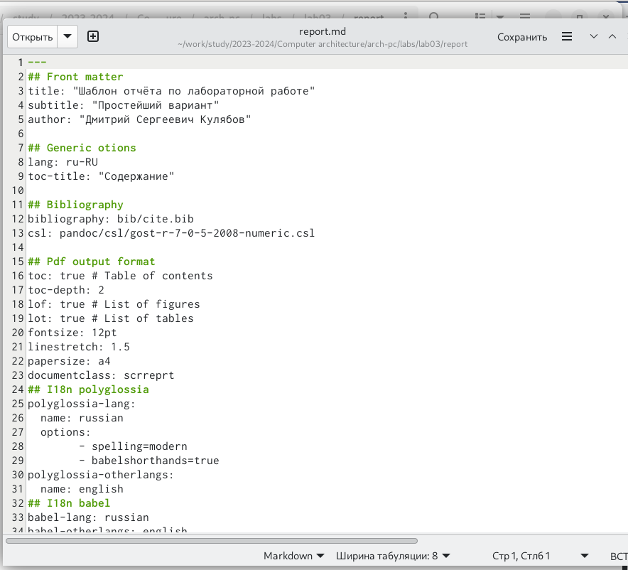
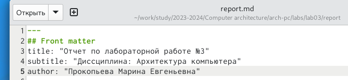
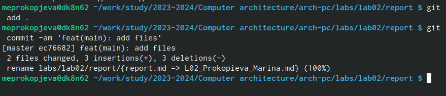
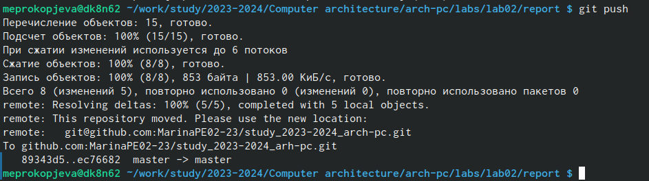

---
## Титульный лист
*РОССИЙСКИЙ УНИВЕРСИТЕТ ДРУЖБЫ НАРОДОВ*

**Факультет физико-математических и естественных наук**

**Кафедра прикладной информатики и теории вероятностей**

**ОТЧЕТ** 

**ПО ЛАБОРАТОРНОЙ РАБОТЕ № 2**

*дисциплина: Архитектура компьютеров и операционных систем*	

Студент: Прокопьева Марина
Студенческий билет: 1132237370
Группа:  НБИбд-02-23 

**МОСКВА**

2023 г

# Цель работы

Целью работы является освоение процедуры оформления отчётов с помощью легковесного языка разметки Markdown. 

# Выполнение работы

*1*
Перешла в терминал.

*2*
Перешла в каталог курса формирований при выполнении лабораторной работы №2 

Обновила локальный репозиторий, скачав изменения из удаленного репазитория с помощью команды git pull

*3*
Перешла в каталог с шаблоном отчета по лабораторной работе №3 

*4*
Провела компиляцию шаблона с использованием Makefile. Для этого ввела команду make. У меня сгенерировались файлы. Я также открыла их и проверила.

*5*
Удалила полученные файлы с использованием  Makefile. Для этого ввела команду make clean. Так же проверила работу команды

*6*
Открыла файл report.md с помощью тектового редактора и нимательно изучила структуру этого файла. 

*7*
Заполнила отчет и скомпилировала его с использованием Makefile.

*8*
Загрузить файлы на Github.

# Выводы

Освоила процедуру оформления отчетов с помощью легковесного языка разметки Markdown. 

