---
## Front matter
title: "Отчёт по лабораторной работе №5"
subtitle: "Основы работы с Midnight Commander (mc). Структура программы на языке ассемблера NASM. Системные вызовы в ОС GNU Linux"
author: "Прокопьева Марина Евгеньевна"

## Generic otions
lang: ru-RU
toc-title: "Содержание"

## Bibliography
bibliography: bib/cite.bib
csl: pandoc/csl/gost-r-7-0-5-2008-numeric.csl

## Pdf output format
toc: true # Table of contents
toc-depth: 2
lof: true # List of figures
lot: true # List of tables
fontsize: 12pt
linestretch: 1.5
papersize: a4
documentclass: scrreprt
## I18n polyglossia
polyglossia-lang:
  name: russian
  options:
	- spelling=modern
	- babelshorthands=true
polyglossia-otherlangs:
  name: english
## I18n babel
babel-lang: russian
babel-otherlangs: english
## Fonts
mainfont: PT Serif
romanfont: PT Serif
sansfont: PT Sans
monofont: PT Mono
mainfontoptions: Ligatures=TeX
romanfontoptions: Ligatures=TeX
sansfontoptions: Ligatures=TeX,Scale=MatchLowercase
monofontoptions: Scale=MatchLowercase,Scale=0.9
## Biblatex
biblatex: true
biblio-style: "gost-numeric"
biblatexoptions:
  - parentracker=true
  - backend=biber
  - hyperref=auto
  - language=auto
  - autolang=other*
  - citestyle=gost-numeric
## Pandoc-crossref LaTeX customization
figureTitle: "Рис."
tableTitle: "Таблица"
listingTitle: "Листинг"
lofTitle: "Список иллюстраций"
lotTitle: "Список таблиц"
lolTitle: "Листинги"
## Misc options
indent: true
header-includes:
  - \usepackage{indentfirst}
  - \usepackage{float} # keep figures where there are in the text
  - \floatplacement{figure}{H} # keep figures where there are in the text
---

# Цель работы

Приобретение практических навыков работы в Midnight Commander. Освоение инструкций
языка ассемблера mov и int.

# Теоретическое введение

Основы работы с Midnight Commander

Midnight Commander (или просто mc) — это программа, которая позволяет просматривать
структуру каталогов и выполнять основные операции по управлению файловой системой,
т.е. mc является файловым менеджером. Midnight Commander позволяет сделать работу с
файлами более удобной и наглядной.
Для активации оболочки Midnight Commander достаточно ввести в командной строке mc и
нажать клавишу Enter.
В Midnight Commander используются функциональные клавиши F1 — F10 , к которым
привязаны часто выполняемые операции

Структура программы на языке ассемблера NASM

Программа на языке ассемблера NASM, как правило, состоит из трёх секций: секция кода
программы (SECTION .text), секция инициированных (известных во время компиляции)
данных (SECTION .data) и секция неинициализированных данных (тех, под которые во
время компиляции только отводится память, а значение присваивается в ходе выполнения
программы) (SECTION .bss).

Для объявления инициированных данных в секции .data используются директивы DB, DW,
DD, DQ и DT, которые резервируют память и указывают, какие значения должны храниться в
этой памяти:
• DB (define byte) — определяет переменную размером в 1 байт;
• DW (define word) — определяет переменную размеров в 2 байта (слово);
• DD (define double word) — определяет переменную размером в 4 байта (двойное слово);
• DQ (define quad word) — определяет переменную размером в 8 байт (учетверённое слово);
• DT (define ten bytes) — определяет переменную размером в 10 байт.

Директивы используются для объявления простых переменных и для объявления масси-
вов. Для определения строк принято использовать директиву DB в связи с особенностями
хранения данных в оперативной памяти.
Синтаксис директив определения данных следующий:
<имя> DB <операнд> [, <операнд>] [, <операнд>]

Для объявления неинициированных данных в секции .bss используются директивы resb,
resw, resd и другие, которые сообщают ассемблеру, что необходимо зарезервировать за-
данное количество ячеек памяти.

Описание инструкции mov

Инструкция языка ассемблера mov предназначена для дублирования данных источника в
приёмнике. В общем виде эта инструкция записывается в виде
mov
dst,src
Здесь операнд dst — приёмник, а src — источник.
В качестве операнда могут выступать регистры (register), ячейки памяти (memory) и непосредственные значения (const). В табл. 5.4 приведены варианты использования mov с разными операндами

ВАЖНО! Переслать значение из одной ячейки памяти в другую нельзя, для этого необхо-
димо использовать две инструкции mov:
moveax, x
movy, eax
Также необходимо учитывать то, что размер операндов приемника и источника должны
совпадать. Использование слудующих примеров приведет к ошибке:
• mov
• mov
al,1000h — ошибка, попытка записать 2-байтное число в 1-байтный регистр;
eax,cx — ошибка, размеры операндов не совпадают.

Описание инструкции int

Инструкция языка ассемблера intпредназначена для вызова прерывания с указанным
номером. В общем виде она записывается в виде
int n
Здесь n — номер прерывания, принадлежащий диапазону 0–255.
При программировании в Linux с использованием вызовов ядра sys_calls n=80h (принято
задавать в шестнадцатеричной системе счисления).
После вызова инструкции int 80h выполняется системный вызов какой-либо функции
ядра Linux. При этом происходит передача управления ядру операционной системы. Чтобы
узнать, какую именно системную функцию нужно выполнить, ядро извлекает номер систем-
ного вызова из регистра eax. Поэтому перед вызовом прерывания необходимо поместить в
этот регистр нужный номер. Кроме того, многим системным функциям требуется передавать
какие-либо параметры. По принятым в ОС Linux правилам эти параметры помещаются в по-
рядке следования в остальные регистры процессора: ebx, ecx, edx. Если системная функция
должна вернуть значение, то она помещает его в регистр eax.

Системные вызовы для обеспечения диалога с пользователем

Простейший диалог с пользователем требует наличия двух функций — вывода текста на
экран и ввода текста с клавиатуры. Простейший способ вывести строку на экран — использо-
вать системный вызов write. Этот системный вызов имеет номер 4, поэтому перед вызовом
инструкции int необходимо поместить значение 4 в регистр eax. Первым аргументом write,
помещаемым в регистр ebx, задаётся дескриптор файла. Для вывода на экран в качестве
дескриптора файла нужно указать 1 (это означает «стандартный вывод», т. е. вывод на экран).
Вторым аргументом задаётся адрес выводимой строки (помещаем его в регистр ecx, напри-
мер, инструкцией mov ecx, msg). Строка может иметь любую длину. Последним аргументом
(т.е. в регистре edx) должна задаваться максимальная длина выводимой строки.
Для ввода строки с клавиатуры можно использовать аналогичный системный вызов read.
Его аргументы – такие же, как у вызова write, только для «чтения» с клавиатуры используется
файловый дескриптор 0 (стандартный ввод).
Системный вызов exit является обязательным в конце любой программы на языке ассем-
блер. Для обозначения конца программы перед вызовом инструкции int 80h необходимо
поместить в регистр еах значение 1, а в регистр ebx код завершения 0.

# Выполнение лабораторной работы

1. Открыла Midnight Commander

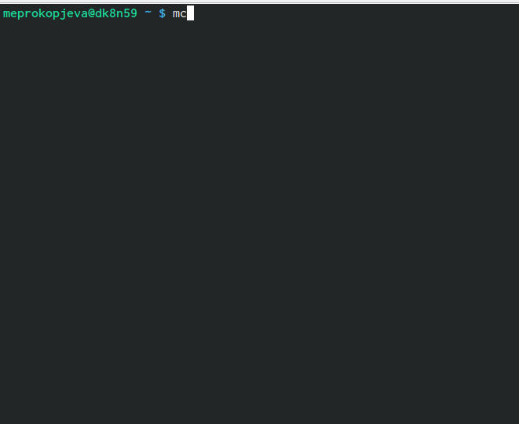{#fig:001 width=70%}

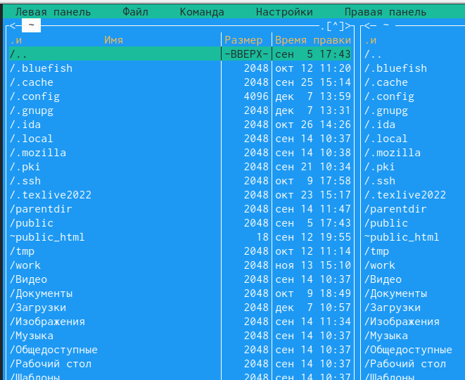{#fig:002 width=70%}

2. Пользуясь клавишами вверх, вниз и Enter перешла в каталог ~/work/arch-pc

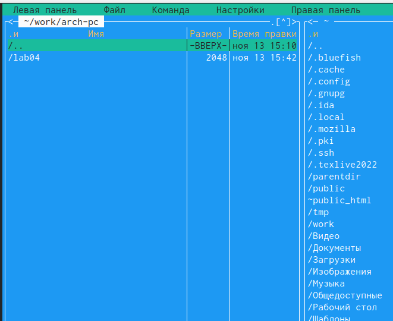{#fig:003 width=70%}

3. С помощью функциональной клавишы F7 создала папку lab05 и перешла в созданный каталог.

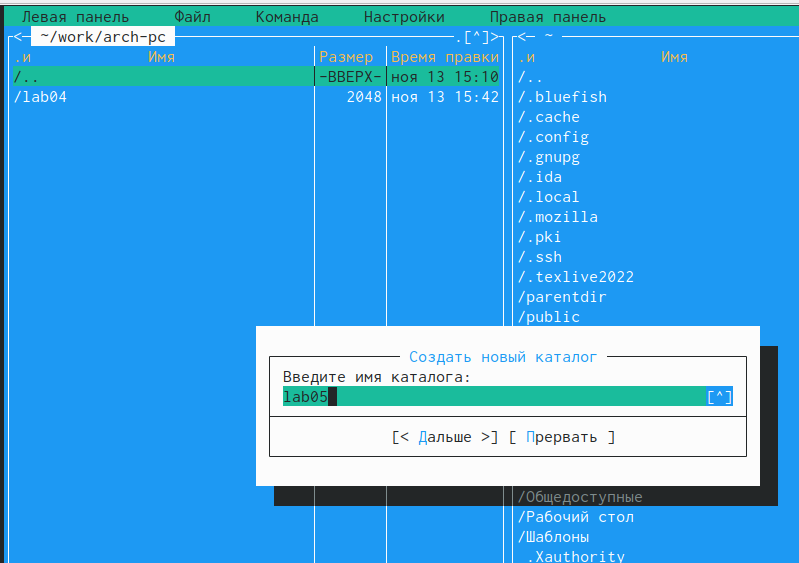{#fig:004 width=70%}

4. Пользуясь строкой ввода и командой touch создала файл lab5-1.asm

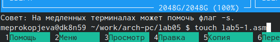{#fig:004 width=70%}

5. С помощью функциональной клавиши F4 открыла файл lab5-1.asm для редактирова-
ния во встроенном редакторе.

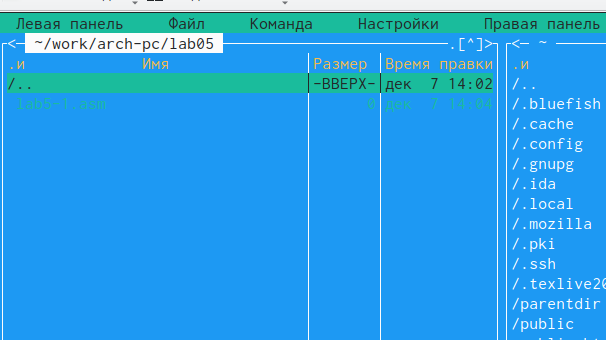{#fig:004 width=70%}

6. Ввела текст программы из листинга 5.1 и сохранила изменения. 

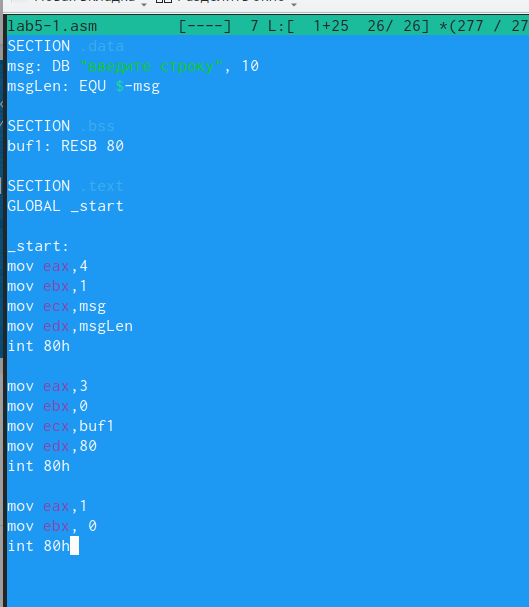{#fig:004 width=70%}

7. С помощью функциональной клавиши f3 открыла файл для просмотра и убедилась, что файл содержит тест программы 

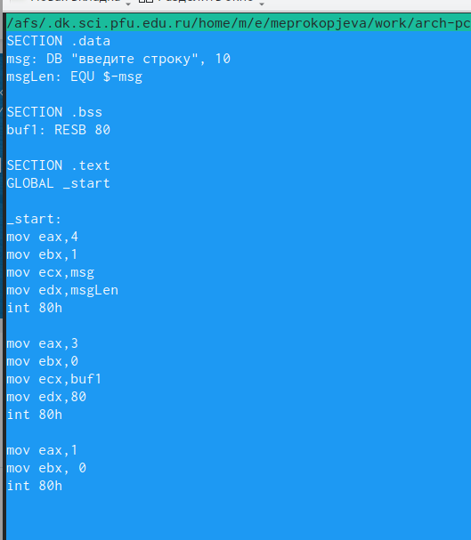{#fig:004 width=70%}

8. Оттранслировала текст программы в объектный файл. Выполнила компонировку объектного файла и запустила получившийся исполняемый файл. 

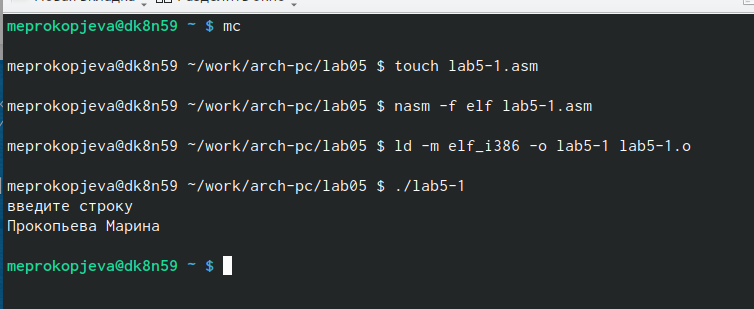{#fig:004 width=70%}

9. Скачала файл in_out.asm со страницы в туис. 

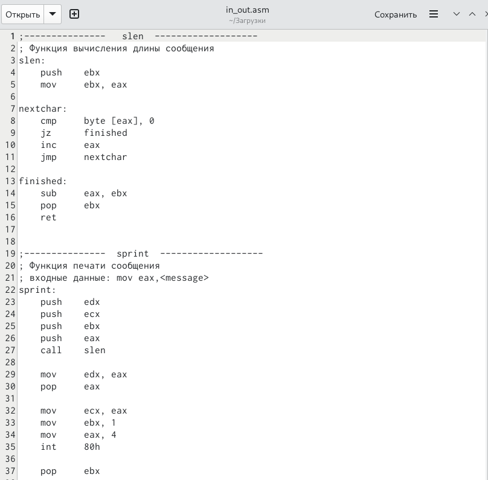{#fig:004 width=70%}

10. Переместила его в тот же каталог, что и файл с программой, в которой он используется. 

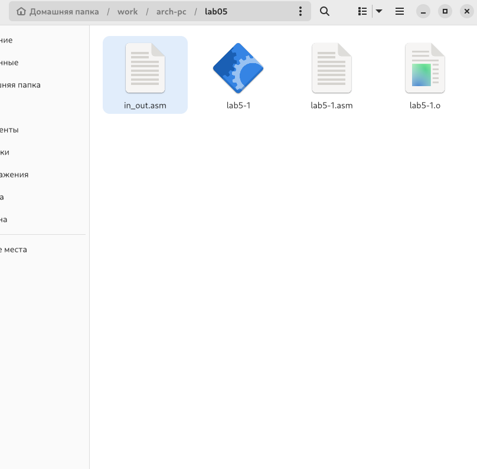{#fig:004 width=70%}
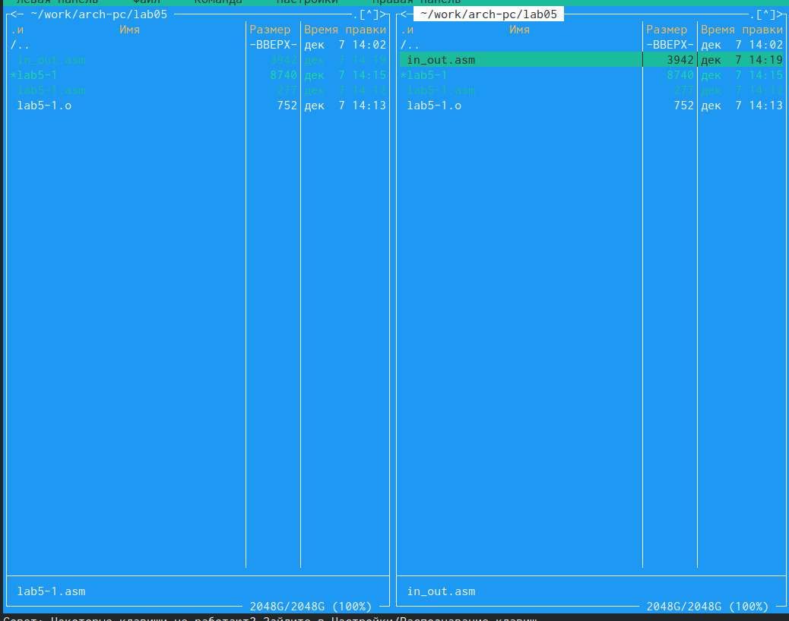{#fig:004 width=70%}

11. С помощью функциональной клавиши F6 создала копию файла lab5-1.asm с именем
lab5-2.asm.

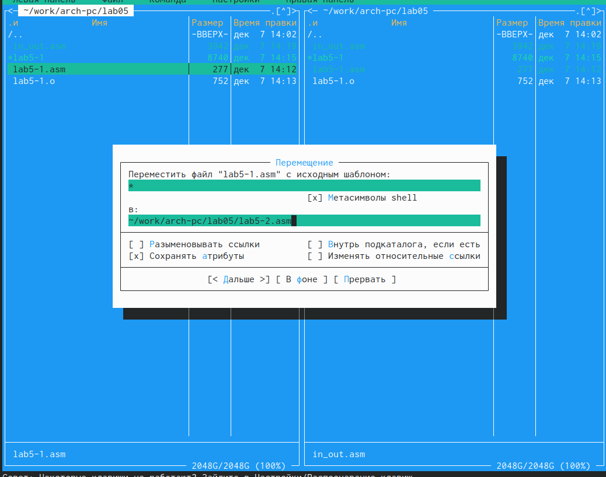{#fig:004 width=70%}
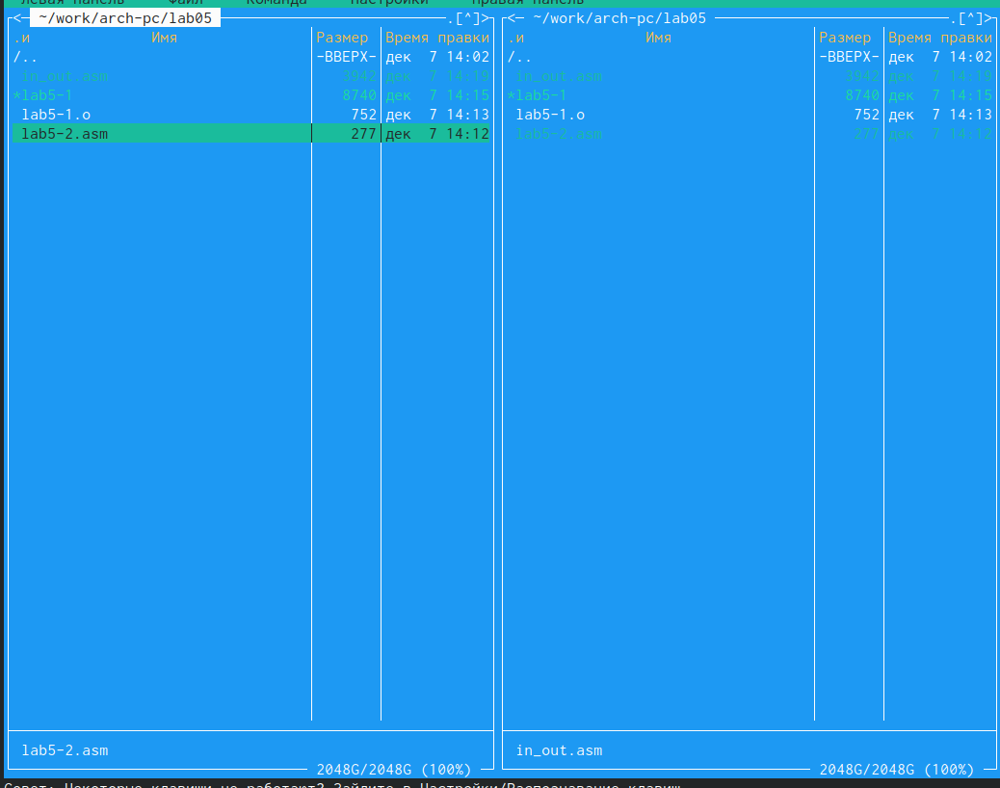{#fig:004 width=70%}

12. Исправила текст программы файла с использованием программ из внешнего файла in_out.asm. И проверила работу программы. 
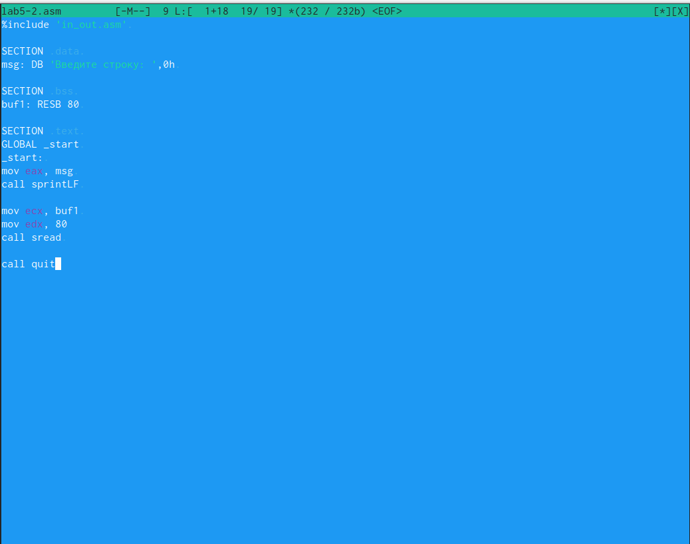{#fig:004 width=70%}
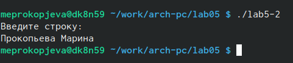{#fig:004 width=70%}

**Самостоятельная работа**

1. Создала копию файла lab5-1.asm и внесла изменения, чтобы программа работала по алгоритму в задании. Проверила работу программы. 

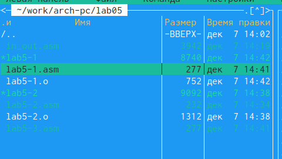{#fig:004 width=70%}
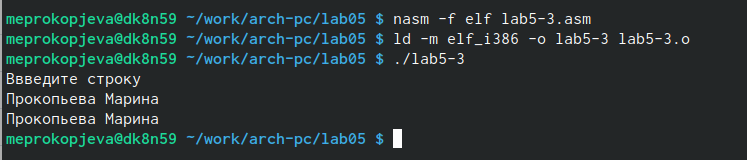{#fig:004 width=70%}

2. Создала копию файла lab5-2.asm и внесла изменения, чтобы программа работала по алгоритму в задании. Проверила работу программы. 

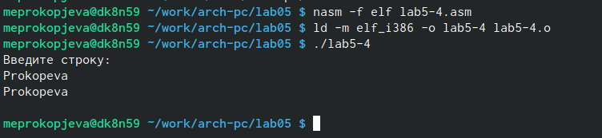{#fig:004 width=70%}
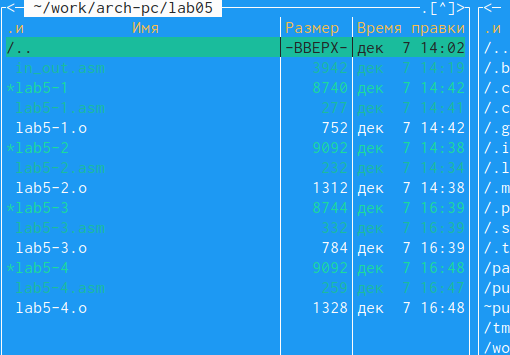{#fig:004 width=70%}

# Выводы

Приобрела практические навыки работы в Midnight Commander. Освоила инструкции
языка ассемблера mov и int.

# Список литературы{.unnumbered}

::: {#refs}
:::
